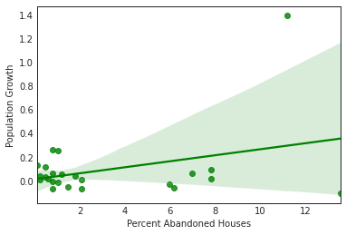

# Exploring Housing Development Data in Baltimore, MD. 
## Background Information
Baltimore has seen a steady decline in population in recent years, and numbers continue to drop as residents relocate due to high crime rates (which increased dramatically after the death of Freddie Gray in 2015), lack of economic opportunity, and the weak education system. The neighborhoods in East and West Baltimore, most of which are predominantly low-income Black and African American communities, are enduring the lasting ramifications of population loss ([source](https://nypost.com/2019/04/19/census-estimates-show-baltimores-population-continues-to-plummet/)). Residents leave these segregated and disadvantaged communities  and with no flow of newcomers to fill their place, vacant properties become areas of criminal and drug activity.   
## Business Question
Before delving into the consequences of the city's failing infrastructure, we must first understand the movement of populations. What relationship exists between population growth and prevalence of vacant properties in low-income neighborhoods, and how can we use this information to make informed decisions about the future of housing and community development in Baltimore?
## Data Sources 
1. Population Growth Data: [raw dataset](population_growth.csv) of population percent change from 2010-2015. Pulled from Baltimore Department of Planning [Interactive City Map](https://baltplanning.maps.arcgis.com/apps/webappviewer/index.html?id=d45903fd0a9e4132903920526fcafac7).
1. Vacant Residential Properties Data: [raw dataset](abandoned_housing.csv) of percentages of residential properties that are vacant and abandoned from 2010-2018 categorized by Community Statistical Areas. Pulled from [Baltimore Neighborhood Indicators Alliance](https://vital-signs-bniajfi.hub.arcgis.com/), an open data source that measures indicators of quality of life and health of Baltimore neighborhoods.
1. **exploring-baltimore-development-crisis-kathytien.ipynb**: a Google Colaboratory notebook with data organization and visualization. 
## Data Answer

The scatter plot and trendline above shows a slight positive correlation between population growth and percentage of abandoned residential properties; each point on the plot represents a Community Statistical Area. To explain this simultaneous increase in population and vacant housing in these neighborhoods, we have to mention the discrepancies of city-level and neighborhood data. Although the city as a whole has seen steady drops in population, a handful of neighborhoods (e.g., Charles Village and Downtown areas) have actually seen [increases in non-Black populations](https://www.baltimoresun.com/maryland/baltimore-city/bs-md-census-estimate-population-race-20190619-story.html). This increase directly follows the city's implementation of community development programs to improve neighborhood infrastructure and standard of living. However, this influx of population and economic investment have displaced low-income individuals. Baltimore natives within these neighborhoods are no longer able to afford the cost of living, and the mass movement of individuals out of their homes have caused an increase in vacant housing.  Thus, efforts by the city government to bolster economic activity and population growth have led to the issue of [gentrification](https://baltimorefishbowl.com/stories/study-baltimore-has-seen-one-of-the-highest-rates-of-gentrification-in-the-u-s/) of neighborhoods.

## Impact on Stakeholder Recommendation
Gentrification has the unintended consequence of forcing disadvantaged populations to leave their communities, depriving them further of stable housing and economic opportunity. The final solution we propose to our stakeholder, Baltimore Development Corporation, must consider the effects of gentrification as they make decisions to foster economic development within Baltimore's segregated neighborhoods.
